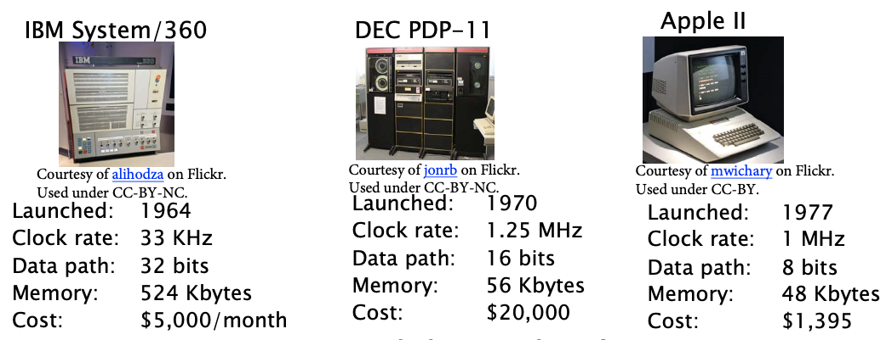
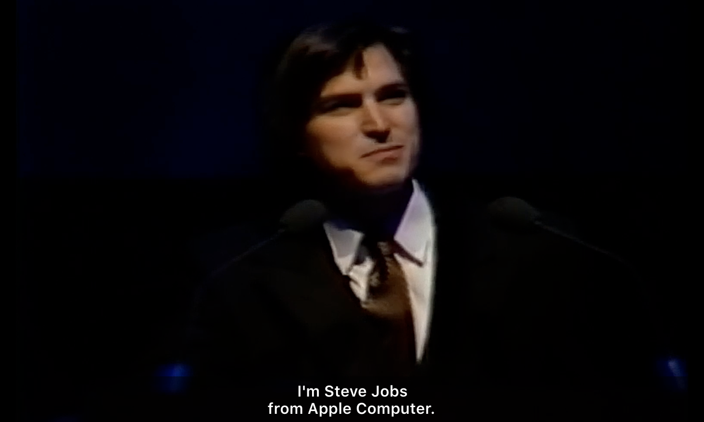
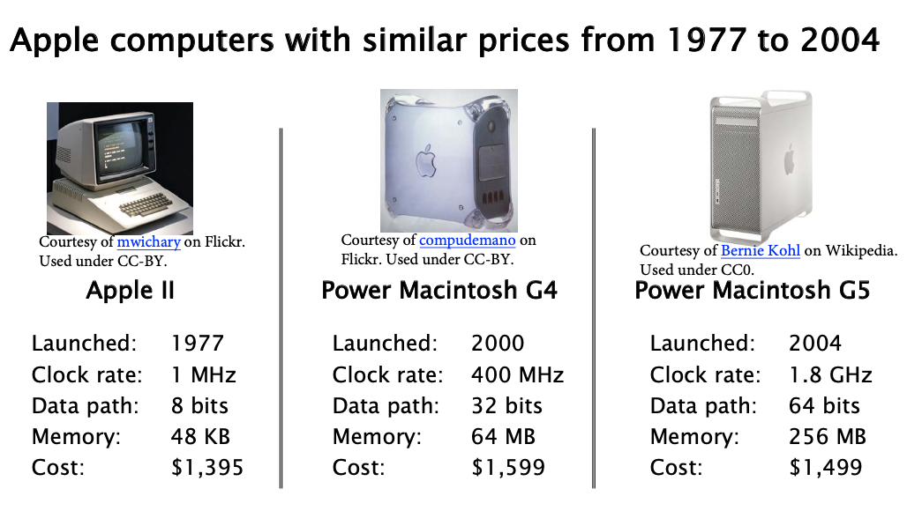
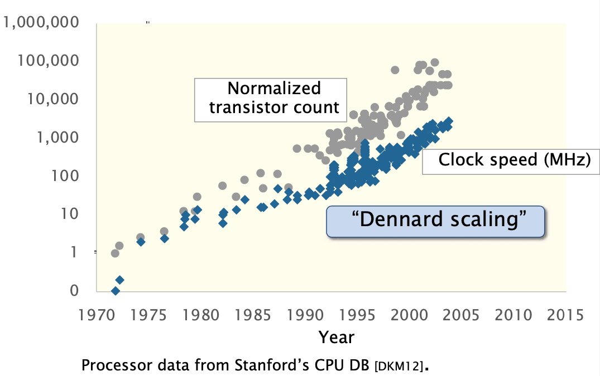
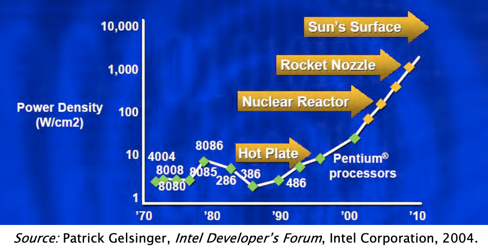
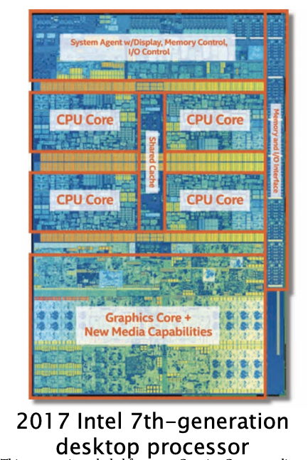
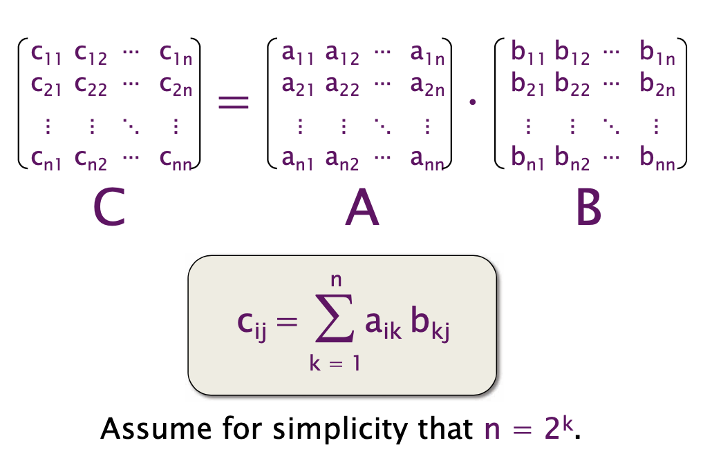

# Performance Engineering
#### Angorithm4 Webinar #1 by Jiawei Wang 2021-10-15

##1 Why Performance Engineering?
### Currency
* Performance is the **currency** of computing. You can often “buy” needed properties with performance.
    * **Functionality**  **Reliability**  **Correctness**  **Testability**  **Maintainability**...

### Modern Hardware (Complex)
* As the hardware become more and more complex, How can we write software to utilize modern hardware **efficiently**?

#### 1) The Second Generation (1955–65) Transistors and Batch Systems
**[OSDI Notes Link](https://github.com/Angold-4/OSDI/blob/master/Chapter/Chapter1/2HSE.md#2-the-second-generation-195565-transistors-and-batch-systems)**

* Many programs strained the machine’s resources.
* Software performance engineering was common
* Programs had to be planned around the machine.
* No "Performance Engineering"

#### 2) The Fourth Generation (1980-2004) Personal Computers
**[OSDI Notes Link](https://github.com/Angold-4/OSDI/blob/master/Chapter/Chapter1/4MCOS.md)**



##### Why and How? -> Moore’s Law and Dennard Scaling


* **Moore’s Law** -- **observation** by Gordon Moore in 1965 <br>
    * the number of transistors on a microchip **doubled** about every year.
    * How? 8 bits -> 16 bits -> 32 bits + smaller transistors

* **Dennard Scaling** As transistors get smaller, their **power density** stays constant.
    * **1. why smaller faster? ** -> Because its gate requires shorter charging and discharging time **[youdao](https://note.youdao.com/web/#/file/WEB23e18924c57ddb8c09563b64950ac104/note/WEBc36af711fa7632e2513f6114a328589c/)**
    * **2. what is power density?** from [wikipedia](https://en.wikipedia.org/wiki/Power_density#:~:text=Power%20density%20is%20the%20amount,expressed%20as%20W%2Fm3.)<br>
    Power density is the amount of power (time rate of energy transfer) per unit volume.

> **If you found something was too slow, wait couple of years!**

#### 3) The Fourth Generation (also) (2004-present)
**All that came to end after 2004**


#### 1. Power Density (Clock Rate)


If the scaling of clock frequency had continued its trend of 25%-30% increase per year.<br>
**The tempreture of chip would reach the sun's surface!** (Dannard Scaling **X**)

**Solution -> keep the frequency unchanged**<br>

 
#### 2. Semicondictor fabrication (growing slower than before)
* **0.5um -> 0.35um (1 year)**
* **22nm -> 14nm** (3 years) 
* **14nm -> 10nm** (4 years)


**Solution -> Introduce Paralleism in the form of multicore processors.**<br>


* To scale performance, processor manufacturers put **many processing cores** on the microprocessor chip.
* Each generation of Moore’s Law potentially doubles the number of cores. (still work!)


### The Performance is No Longer Free  
* Moore’s Law continues to increase computer performance.
* **We couldn't just speed up the hardware like the old days.**
* If you wants to use that potential, you had to do **parallel programming**.etc.


#### Hardware

* big multicore processors 
* complex cache hierarchies
* wide vector units
* GPU
* FPGA


#### Software
* parallel-processing
* vector units
* caches 
* prefetchers
* GPU’s
* hyperthreading
* dynamic frequency scaling
* ...

### We need to write software to utilize modern hardware efficiently.


## 2. Different Abstraction


**Square-Matrix Multiplication**



### 1) Python   
```python
import sys, random
from time import *

n = 4096

A = [[random.random()
    for row in xrange(n)]
    for col in xrange(n)]
B = [[random.random()
    for row in xrange(n)]
    for col in xrange(n)]

C = [[0 for row in xrange(n)
    for col in xrange(n)]]

start = time()
for i in xrange(n):
    for j in xrange(n):
        for k in xrange(n):
            C[i][j] += A[i][k] * B[k][j]
end = time()

print '%0.6f' % (end - start)

```

* **Running time = 21042 seconds -> 6 hours**
* Analysis:
  * **C + A * B: Two opeartions each iteration**
  * When n is **`4096(2^13)`** There are **`2 * n^3 = 2 * (2^13)^3 = 2^37`** floating point operations.
  * Python gets **`2^37 / 21042 = 6.25M`** floating point opeartions per second.
  * Peak = **`836G`** floating point opeartions per second
  * **Python gets `0.00075%` of peak**

### 2) Java
```java
import java.util.Random;

public class mm_java {
    static int n = 4096;
    static double[][] A = new double[n][n];
    static double[][] B = new double[n][n];
    static double[][] C = new double[n][n];

    public static void main(String[], args) {
        Random r = new Random();

        for (int i=0; i<n; i++) {
            for (int j=0; j<n; j++) {
                A[i][j] = r.nextDouble();
                B[i][j] = r.nextDouble();
                C[i][j] = 0;
            }
        }

        long start = System.nanoTime();

        for (int i = 0; i < n; i++) {
            for (int j = 0; j < n; j++) {
                for (int k = 0; k < n; k++) {
                    C[i][j] += A[i][k] * B[k][j];
                }
            }
        }

        long stop = System.nanoTime();

        double tdiff = (stop - start) * 1e-9;
        System.out.println(tdiff);
    }
}
```

* **Running time = 2738 seconds -> 46 minutes**
* **Analysis: About 8.8x faster than Python**
* ...
* **Java gets `0.007%` of peak**


### 3) C
```c
#include <stdlib.h>
#include <stdio.h>
#include <sys/time.h>

#define n 4096
double A[n][n;]
double B[n][n;]
double C[n][n;]

float tdiff(struct timeval *start, struct timeval *end) {
    return (end->tv_sec- start->tv_sec) + 1e-6*(end->tv_usec-start->tv_usec);
}

int main(int argc, const char *argv[]) {
    for (int i = 0; i < n; ++i) {
        for (int j = 0; j < n; ++j) {
            A[i][j] = (double)rand() / (double)RAND_MAX;
            B[i][j] = (double)rand() / (double)RAND_MAX;
            C[i][j] = 0;
        }
    }
     struct timeval start, and;
     gettimeofday(&start, NULL);

     for (int i = 0; i < n; ++i) {
         for (int j = 0; j < n; ++j) {
             for (int k = 0; k < n; ++k) {
                 C[i][j] += A[i][j] * B[i][j];
             }
         }
     }

     gettimeofday(&end, NULL);
     printf("0.6f\n", tdiff(&start, &end));
     return 0;
}
```
* **Running time = 1156 seconds -> 19 minutes**
* **Analysis: About 2x faster than Java**
* **About 18x faster than Python**
* ...
* **C gets `0.014%` of peak**


