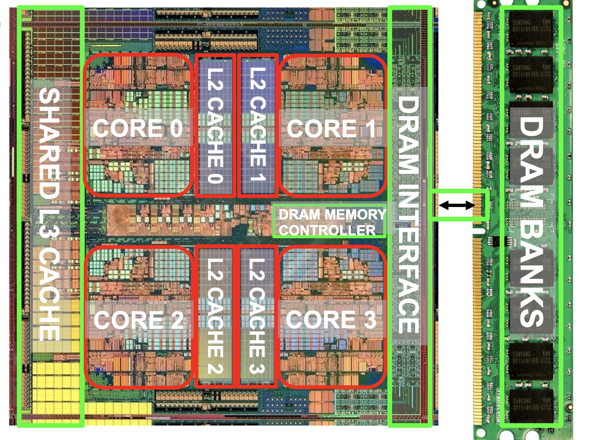
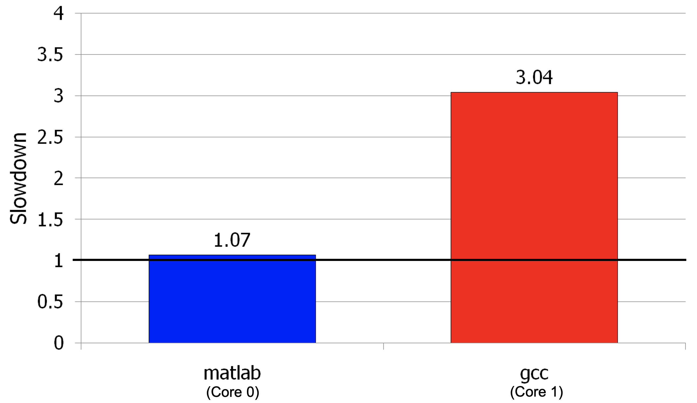
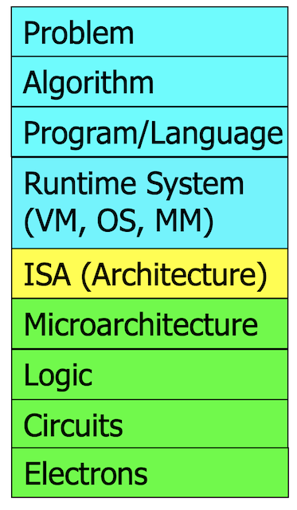

# Angorithm4 Webinar #2 

#### Cohost by Jiawei Wang 2021-10-22


## 1. M1


### (1). TSMC 5nm
**Taiwan Semiconductor Manufacturing Company**


**[Notes for industry](https://note.youdao.com/web/#/file/WEB23e18924c57ddb8c09563b64950ac104/note/WEBf16acca39d735b6b9d735343b839905a/)**

* **Transistor Density: 180%**
* **Transistor Performance: 115%**
* **Power Consumption: 70%**

### (2). Architecture




** Programmable Computer**<br>
Using instructions flow to control the Computer
#### Examples:

#### CISC
```asm
ADD  $4, 14(%eax, %ebx, 8)
```
* **Usage: Adding `4` to the data stored in memory: `14 + %eax + (%ebx * 8)`** 

#### RISC
```asm
LOAD (%eax), %ebx
LOAD $4, %ecx
ADD  %ecx, %ebx
STORE %ecx, (%eax)
```


**[An Article from stanford (Cisc vs Risc)](https://cs.stanford.edu/people/eroberts/courses/soco/projects/risc/risccisc/)**


* **Reduced Instruction Set Computer**
    * **Fixed Instruction Format and Fewer Instructions**
        * Faster to Encode and Decode 
        * Require more Instruction Memory and Registers
        * Circuit is Simpler
    * **Examples**
        * MIPS, ARM, AVR
    * **Often used in**
        * **Mobile Devices** (Phone)
        * **Less Power-Consuming Devices** (Embedded device)


* **Complex Instruction Set Computer**
    * **Instruction Takes Longer to Execute** (Pipeline)
    * **Larger Number of Instructions** (Decode Hardware)
    * **Examples**
        * IBM System 360, x86, IA-32, AMD-64, x86-64
    * **Often usde in**
        * **Large Servers**
        * **PC**


## (3). Apple

### Comparing with Other Laptop Company
* **Dell, Lenovo...** 
* Apple Has its own **Ecology** (Unique and Cannot Compete)

### Comparing with Other Semiconductor Company
* **Intel, TSMC...**
* Apple can sell its products **directly** to its user (Maximum Profit)


### The Comination fo Software and Hardware (For Specific Task)

### My Concern
* **1. Desktop GPU and CPU (> 300W)?** 
* **2. Just for Specific Software (Logic Pro/ Final Cut Pro...)**
* **3. Gamers?**


## 2. Computer Architecture

* **As long as everything goes well, not knowing what happens in the underlying level (or above) is not a problem.**







