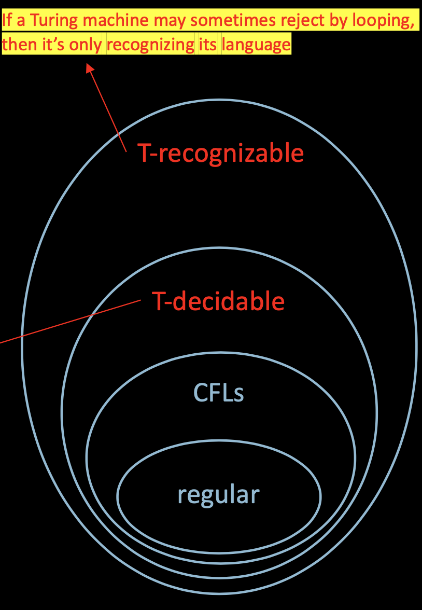
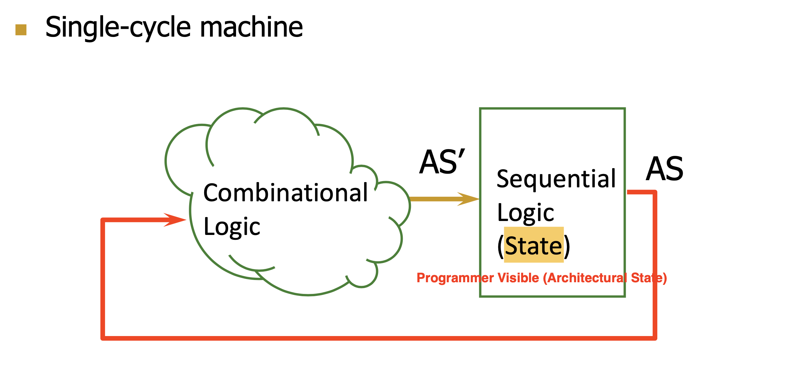
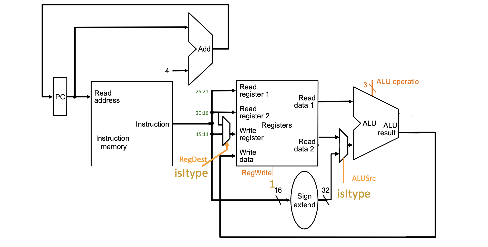
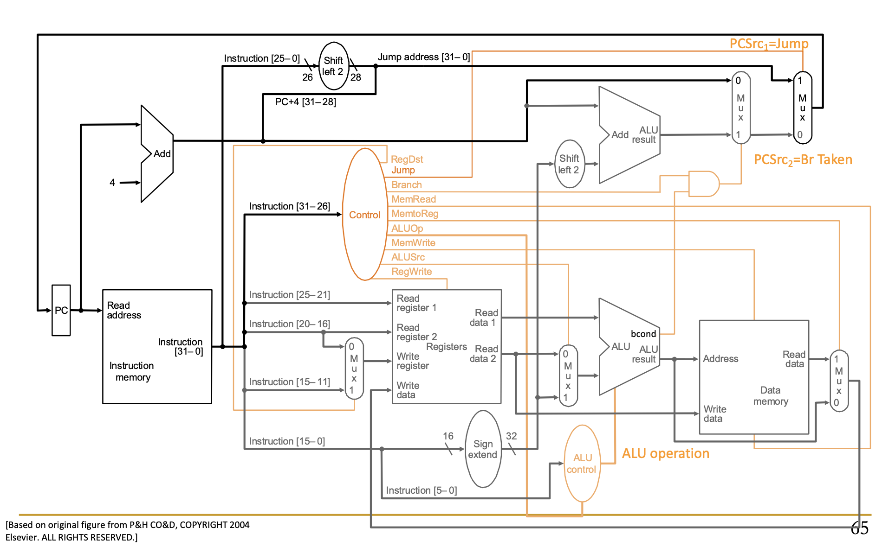

# Angorithm4 Webinar #6

#### Cohost by Jiawei Wang 2021-11-26


## 1. Announcement
### 1. About angorithm4.org
  * **In Progress...**
  * **With database, and support notes display, video playing etc.**
  * **About one month** (till end of this year)
  * **Runs on my Raspberry Pi 4B**
  * **A challenge for me, since it won't based on any web framework**
  * Maybe you can help...

### 2. About Linux:
  * Run Ubuntu on VirtualBox is **not** a good idea..., Mostly, especially when you do not have a desktop computer.
  * **Instead, Try boot Ubuntu sepreate from Windows (Install ubuntu 20.04 LTS alongside windows 10)**
  * **All you need is a 32GB SD Card and [this](https://www.youtube.com/watch?v=-iSAyiicyQY) video**


## 2. Microarchitecture - Single-Cycle

### 1. Turing Machine



#### T-decidable:
**If the Turing machine is always halting**<br>which means always rejecting by explicitly coming to a reject state and halting.

#### T-recognizable:
**If the Turing machine is always reject by looping forever** (From state to state but never stop in the final state).

#### One example of T-recognizable: (Hilbert's 10th Problem)
* Equations of polynomials where solutions must be integers.
* Let D = {p | polynomial p(x1, x2, ..., xk) = 0 **has a solution in integers**}
* E.g. `3x^2 - 2xy -y^2z = 7 Solution: x = 1, y = 2, z = -2`
* Hilbert's 10th problem: **Give an algorithm (TM) to decide D. (Only yes or no)**
* **Matiyasevich proved in 1970: D is not decidable.**


### 2. Single-Cycle Machine



* **Each instrurction takes a single clock cycle to execute**
* From **ISA** point of view, there are **no “intermediate states” between AS and AS’** during instruction execution
* All **six phases** of the instruction processing cycle take a single machine clock cycle to complete
    * Fetch
    * Decode
    * Evaluate Address  
    * Fetch Operands  
    * Execute
    * Store Result


* **Bottom neck of Single-Cycle Machine: The slowest instruction determines cycle time -> long cycle time (STORE)**
* We can have **programmer-invisible state** to optimize the speed of the instruction execution: **multiple state transitions per instruction**
    * **AS -> AS' (transform AS to AS' in a single clock cycle)**
    * **AS -> AS + MS1 -> AS + MS2 -> ... -> AS' (take multiple clock cycles to transform AS to AS')**
* **Multi-Cycle Machine: The slowest "stage" determines cycle time**

### 3. MIPS-Simulator 
* **Source Code: [Angold-4/MIPS-Simulator](https://github.com/Angold-4/MIPS-Simulator)**
* **Based on [CMU 18-447 Lab1](https://course.ece.cmu.edu/~ece447/s15/doku.php?id=labs)**

#### MIPS
* **Microprocessor without interlocked Pipelined Stages**
* The hardware doesn’t do anything to detect the dependency between instructions, everything is handled by the software, so that you can **design a microprocessor that is simple**
* Using C to simulate MIPS-hardware

#### Example



```c
/*
 * handle_addi
 * Add Immediate 
 * Opcode: 8
 * The 16-bit immediate is sign-extended and added to the contents of 
 * general register rs to form the result. The result is placed into general register rt.
 */

int handle_addi(uint32_t instr) {
    // decode source code and target register
    int rs = decode_i_rs(instr);
    int rt = decode_i_rt(instr);

    int32_t immediate = (int32_t) decode_i_immediate(instr);
    // Note: addi normally raises exception on overflow
    // however, this functionality is not implemented here

    NEXT_STATE.REGS[rt] = CURRENT_STATE.REGS[rs] + immediate;

    NEXT_STATE.PC = CURRENT_STATE.PC + 4;

    return STATUS_OK;
}

```




## 3. Eva

* **Source Code: [Angold-4/Eval](https://github.com/Angold-4/Eval)**


### Runtime semantics should be preserved !


### Runtime #1 Arithmatic

### Runtime #2 Variable

### Runtime #3 Function (var lambda)

### Runtime #4 Class (var Environment)

