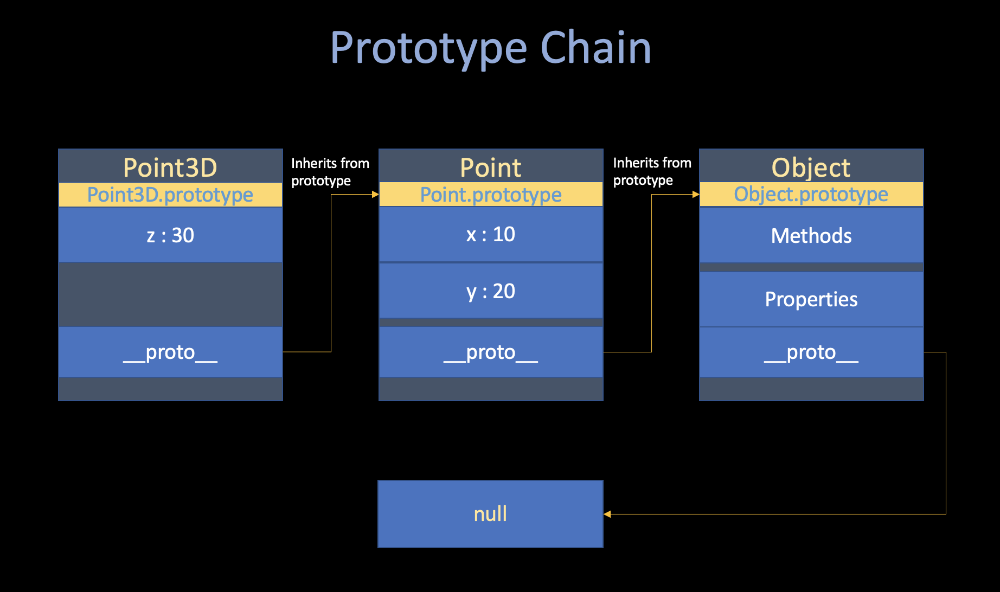
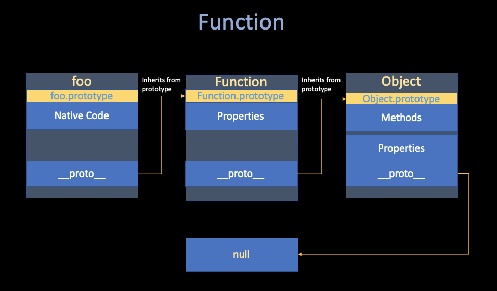
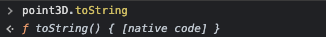
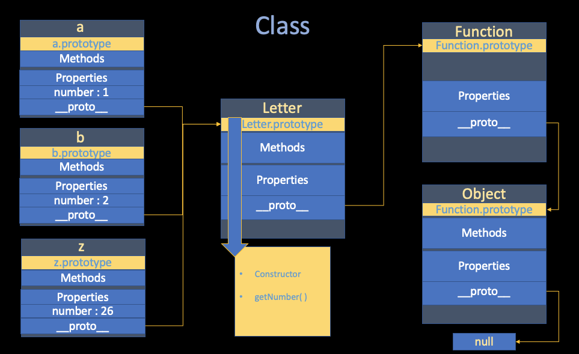

# "JavaScript. The Core" Notes

##### Jiawei Wang (Angold-4) Nov 2021

* **Paper : [JavaScript. The Core](http://dmitrysoshnikov.com/ecmascript/javascript-the-core-2nd-edition/)** 
* **Author : [Dmitry Soshnikov](http://dmitrysoshnikov.com/)**

## 1. ECMAScript

> **Mocha -> LiveScript -> JavaScript -> ECMA-262 -> ECMAScript -> JavaScript (ECMAScript + DOM + BOM)**


To start from the beginning, **JavaScript** derived its name from **Java** and initially **[Brendan Eich](https://en.wikipedia.org/wiki/Brendan_Eich)** (the Co-founder of Mozilla) was asked to develop a language that resembled Java for the web for his company Netscape.<br>
But Eich decided that Java was too complicated and not suitable for web development, **and set out to create a simple language that even a beginner could code in.**<br>

After the language was complete **(Eich "wrote JavaScript in ten days" in 1995)**, the marketing team of Netscape requested Sun to allow them to name it JavaScript as a marketing stunt and hence why most people who have never used JavaScript think it's related to Java.

About a year or two after JavaScript's release in the browser, Microsoft's IE took the language and started making its own implementations such as JScript. At the same time, IE was dominating the market and not long after Netscape had to shut its project.

Before Netscape went down, they decided to start a **standard** that would guide the path of JavaScript, named **ECMAScript**.

### JavaScript is the most popular implementation of the ECMAScript Standard!

After that Microsoft dominated the scenes but at the same time they weren't improving their product(IE) and hence **Firefox** was born (led by **Eich**) and a whole heap of other browsers such as Chrome, Opera, and they use **JavaScript** as their web scripting language (follow the ECMA Standard).

### Notable JS Engines:


#### V8
* From **[Google](https://v8.dev/)**
* Most Used JS Engine
* Used in Chromium-based browsers (Chrome)


#### SpiderMonkey
* From **[Mozilla Foundation](https://spidermonkey.dev/)**
* The First JS Engine
* Used in FireFox


#### JavaScriptCore From WebKit
* From **[Apple](https://developer.apple.com/documentation/javascriptcore)**
* Used in Safari


## 2. Prototype


### i. JavaScript Type
>>  **"With the Prototype, almost everything there can also be presented as an object."**

Let's start off by looking at **the types**. JavaScript programs manipulate values, and those values all belong to a type.<br>
In my opinion, there are only two kinds of [types](https://developer.mozilla.org/en-US/docs/Web/JavaScript/A_re-introduction_to_JavaScript) -- **Primitives** and **Objects**<br>

* **Primitives**
    * Number
    * BigInt
    * String 
    * Boolean
    * null
    * undefined

* **Objects**
    * Function
    * Array
    * Date
    * RegExp


**From the implementation-level perspective, all-of these different types can be implement with Object.**

### ii. Objects

>> **An object is a collection of properties, and has its own prototype -> either another object or null.**

* The **prototype** is a delegation object used to implement **prototype-based inheritance.**<br>
* The **prototype** can be set xeplicitly via either the **`__proto__`** property, or **`Object.create`** method.

```javascript
let point = { // point is an object
    x: 10,
    y: 20,
};

// either this way
let point3D = {
    z: 30,
    __proto__: point,
}

// or this way
let point3D = Object.create(point);
point3D.z = 30;


console.log(
    point3D.x, // 10
    point3D.y, // 20
    point3D.z, // 30
);

```
The **Prototype Chain**, which is a finite chain of object.<br>Shows how JavaScript implement ***inheritance*** and ***shared properties***:



If a property is nout found in the object itself, The rule is very simple: 
* There is an attempt to resolve it in the **prototype**; in **the prototype of the prototype**, etc.
* After the whole prototype chain is considered, if a property eventually not found, the **`undefined`** value is returned.

This mechanism is called **Delegation**, or **Dynamic Dispatch**.<br>
For those readers who want to have a closer look at the **Prototype Chain**, here is the detail:


### iii. Function
Every JavaScript function is actually a **Function object**<br>
or for the implemention level, **A Function is just a object with its native code as a property and inherited from Object**






#### Prototype
Here comes a question:<br>
**We haven't defined any method of object `point3D`. How does this object have `toString()` method?**<br>

In **[ii. Objects](https://github.com/Angorithm4/Webinar/blob/main/2021-12-03/JSCore.md#ii-objects)**, we introduced **Dynamic Dispatch**. <br>
From that, we can know  **`toString()`** method must be defined in the **`Prototype Chain`** of object **`point3D`**.

So, where are the inherited properties and methods defined? 
If you look at the **[Object](https://developer.mozilla.org/en-US/docs/Web/JavaScript/Reference/Global_Objects/Object)** reference page, you'll see listed in the left hand side a large number of properties and methods — many more than the number of inherited members we saw available on the **`point3D`** object. Some are inherited, and some aren't — why is this?

As mentioned above, the inherited ones are the ones defined on the **prototype** property — that is, the ones that begin with **`Object.prototype`**, and not the ones that begin with just **`Object`**. 

**The prototype property's value is an object, which is basically a bucket for storing properties and methods that we want to be inherited by objects further down the prototype chain.**


if you try the following in your console:

```javascript
Object.prototype
```

You'll see a large number of methods defined on Object's **prototype** property, which are then available on objects that inherit from Object, as shown earlier.

You'll see other examples of **prototype chain inheritance** all over JavaScript — try looking for the methods and properties defined on the prototype of the **[String](https://developer.mozilla.org/en-US/docs/Web/JavaScript/Reference/Global_Objects/String), [Date](https://developer.mozilla.org/en-US/docs/Web/JavaScript/Reference/Global_Objects/Date), [Number](https://developer.mozilla.org/en-US/docs/Web/JavaScript/Reference/Global_Objects/Number)**, and
**[Array](https://developer.mozilla.org/en-US/docs/Web/JavaScript/Reference/Global_Objects/Array)** global objects.


### iv. Class

**When several objects share the same initial state and behavior, they form a classification.**<br>

A **"Class"** is just a theoretical abstraction, in the implementation-level, it usually represented as a **"constructior function + prototype"** pair. (or even if a object but cumbersome):

```javascript
// Constructor Function
function Letter(number) {
    this.number = number;
};

// Prototype
Letter.prototype.getNumber = function() {
    return this.number;
}

let a = new Letter(1);
let b = new Letter(2);
// ... 
let z = new Letter(26);


console.log(
    a.getNumber(); // 1
    b.getNumber(); // 2
    // ...
    z.getNumber(); // 26
);
```


For **user-convinence** (sometimes you don't want things to become cumbersome).<br>
The **Class** Abstraction serves exactly this purpose - being a **syntactic sugar** (a construct which semantically does the same, but in a much nicer syntactic form).<br>
It allows creating such multiple objects with the convenient pattern:

```javascript
// Class
class Letter2 {
    constructor(number) {
        this.number = number;
    }

    getNumber() {
        return this.number;
    }
}
```

While you create a **Class** object, this **syntactic sugar** will help you automatically set the **prototype**.<br>
And if you check their prototype, you will find that there is no such big difference - And, both of them are **Object**.


### v. Primitives
At the begining of this [Note](https://github.com/Angorithm4/Webinar/blob/main/2021-12-03/JSCore.md#i-javascript-type). I said: 
>> **All things in JavaScript can be presented as an Object, but there are something called Primitives that usually do not implement as an Object.**

* **Primitives** : that is - **Many things that you interact with regularly** (`String` `Number` and `Boolean`).
* **Reason** : I Believe that is for the **Speed** -- Since most of the time when you create a **Primitive** type variable, you just want to do some calculation with others.<br>
Or in other words - **When you create a Primitive type variable, maybe you just want its `Value`, rather than those "high-level" functions, etc.**

```javascript
var i = 12;
i.p1 = 13;

console.log(i);    // 12
console.log(i.p1); // undefined

```

But **primitives** do have **Object Wrappers** (`String`, `Number`, `Boolean`, etc.); these **objects** have methods and properties while the **primitives** do not.<br>
But the **primitives** appear to have methods because JavaScript silently creates a **Wrapper Object** when code attempts to access any property of a **primitive**.<br>

For example, consider the following code:
```javascript
var s = 'foo';
var sub = s.substring(1, 2); // sub is now the string "o"
```

Behind the scenes, `s.substring(1, 2)` behaves as if it is performing the following (approximate) steps:
1. Create a wrapper **`String` Object** from `s`, equivalent to using `new String(s)`;
2. Call the `substring()` method with the appropriate parameters on the **`String` Object** returned by step1;
3. Dispose of the **`String` Object**;
4. Return the string (primitive) from step2.

And that also explain why we can't access `i.p1`, while we can assign the property to primitives `i`.<br>
--- **We cannot retrieve them**.


## 3. Runtime


