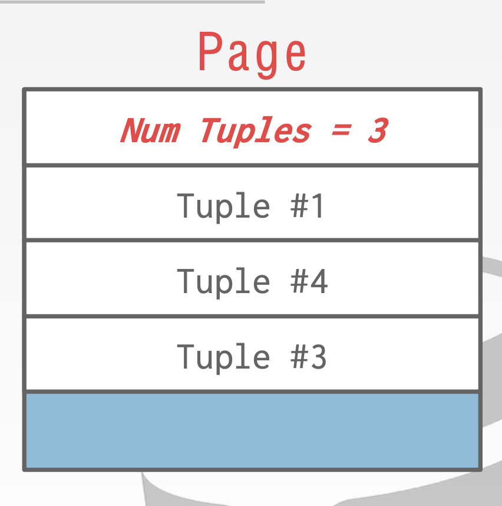
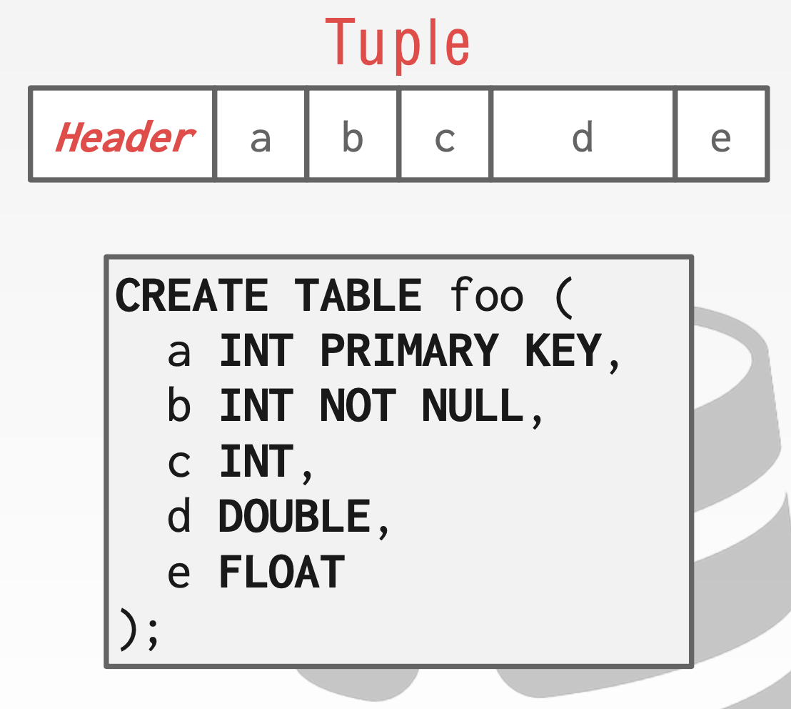
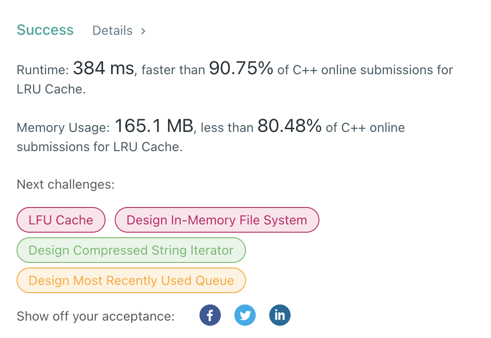

# AtHM4 wEBINAR #8

## 1. angorithm4.org Dev Process

* [x] **Domain Register (USD 7.99/YR)**
* [x] **Web Server Basic (Apache httpd2, Ubuntu)**
* [x] **Server Language (php, C++)**
* [x] **Index Page Design (Custom CSS with Bootstrap)**
* [ ] **Database (Sqlite)**
* [ ] **Applications (Online Docker) (Chat Room)**
* [ ] **User-friendly features (md -> html)** 
* [ ] **Personal Page, information, and other pages (Webinar, Projects...)**
* [ ]........

## 2. Intro to Database
* **How to Store?**
    * **CSV File**?
    
        * How do we ensure that the artist is the same for each album entry?
        * What if somebody overwrites the album year with an invalid string?
        * How do we store that there are multiple artists on an album?
        * What if there are multiple database has relationship?
        * What if there are terabytes data?
        * What if we now want to create a new application that uses the same database?
        * What if two threads try to write to the same file at the same time?
    * **DBMS**
        * **A DBMS is software that allows applications to store and analyze information in a database.**
        * **A general-purpose DBMS is designed to allow the definition, creation, querying, update, and administration of databases.**
        * Faster!

    
* **Where to Store?**

## 3. Buffer Pool

**When the DBMS needs to free up a frame to make room for a new page, it must decide which page to evict from the buffer pool.**
* Correctness
* Accuracy
* Speed

### LRU - Least Recent Used

* **[LeetCode 146. LRU Cache](https://leetcode.com/problems/lru-cache/)**
* **Maintain a timestamp of when each page was last accessed.**
* When the DBMS needs to evict a page, select the one with the oldest timestamp.

## 4. Hashing (Part I)

### i. What is Hashing
* A hash table implements an unordered **associative array** that maps keys to values. (In C++ **`unordered_map`**)
* It uses a **Hash Function** to compute an offset into the array for a given key, from which the desired value can be found.

    * Simplest **Hash Function**: **`mod(n)`**
    * **Map a large key space into a smaller domain?**
    * Space Complexity: O(n)
    * Time Complexity: Average: O(1) **Money Cares about constants!**

* Perfect hash function. → **If key1 ≠ key2, then hash(key1) ≠ hash(key2)**

* **Trade off**
    * Two Phases
        * Hash Function How to map a large key space into a smaller domain.
        * Hashing Scheme How to handle key collisions after hashing.

    * Classic CS Question: **Cost More Storiage but Faster** Vs **Cost Less Storiage but Slower**
    * More Storiage Faster Example: **`Mod`** # of Slots, Collision Rate = 0 (Impossible) (Not always integer)
    * Less Storiage Slower Example  **Hash Function always return 1** additional instructions to handle collision

### ii. Static Hashing

* Static **Assumption: You know the number of elements ahead of time.**

#### Linear Probe Hashing
If we hash into a slot and we find something that’s already there, I’m trying to insert something there. 
We just keep scanning down to the next position and keep going until we find the first open slot
