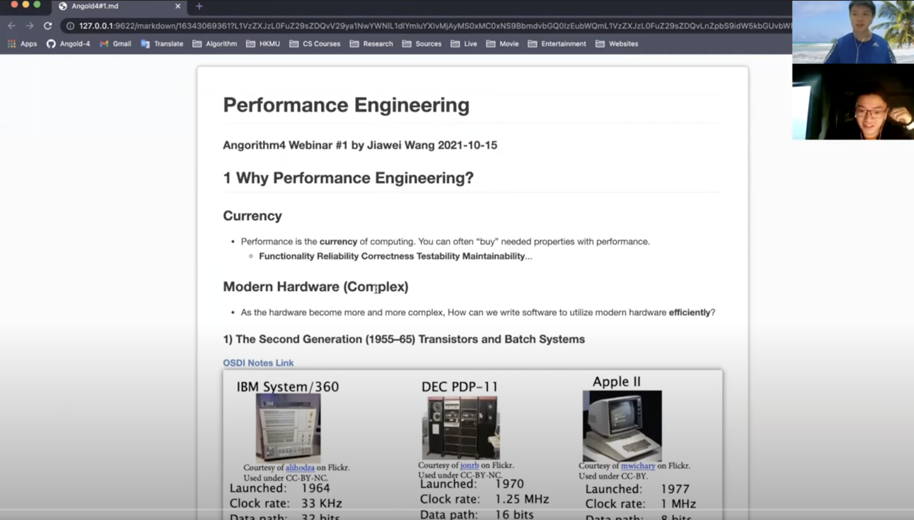
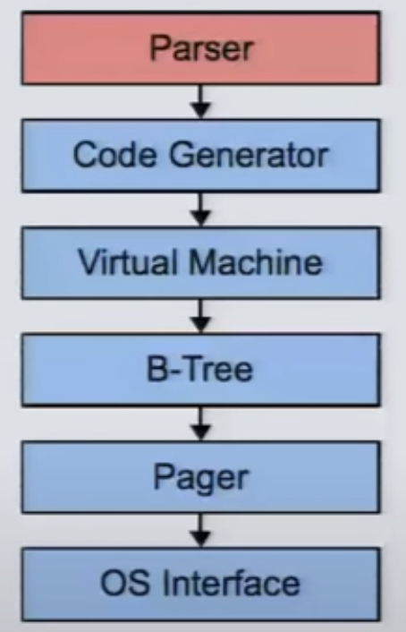
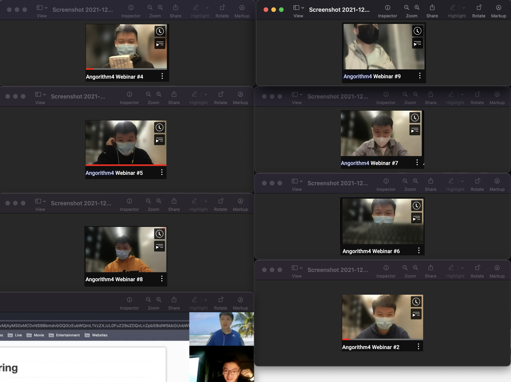

# Angorithm4 Webinar #10

##### Co-host by Jiawei Wang 2021-12-24

## 1. 10th? 



* **Webinar #1 Intro to Performance Engineering**
    * [2021-10-15](https://github.com/Angorithm4/Webinar/tree/main/2021-10-15/Angold4%231.md)
    * Hardware development (Complex)
    * Matrix multiplication (**Python `21041.67s`** -> Optimized **C `3.04s`**)

* **Webinar #2 Intro to Computer Architecture**
    * [2021-10-22](https://github.com/Angorithm4/Webinar/blob/main/2021-10-22/Angold4%232.md)
    * M1 Pro/Max Released
    * RISC vs CISC

* **Webinar #3 Comparision Sort I**
    * [2021-10-29](https://github.com/Angorithm4/Webinar/blob/main/2021-10-29/Angold4%233.md)
    * Trade off in ISA (Semantic Gap)
    * Merge Sort (Comparision Sort i)

* **Webinar #4 Comparision Sort II**
    * [2021-11-05](https://github.com/Angorithm4/Webinar/blob/main/2021-11-05/Angold4%234.md)
    * Dynamic Programming (Fds)
    * Quick Sort (Comparision Sort ii)

* **Webinar #5 Comparision Sort III**
    * [2021-11-19](https://github.com/Angorithm4/Webinar/blob/main/2021-11-19/Angold4%235.md)
    * Virtual Machine 
    * Heap Sort (Comparision Sort iii)
    * Lower Bounds of Comparision Sort (O(NlogN))

* **Webinar #6 Microarchitecture**
    * [2021-11-26](https://github.com/Angorithm4/Webinar/blob/main/2021-11-26/Angold4%236.md)
    * angorithm4.org
    * Turing Machine **(State)**
    * MIPS-Simulator and Eval (AST-Interpreter)

* **Webinar #7 JavaScript. The Core**
    * [2021-12-03](https://github.com/Angorithm4/Webinar/blob/main/2021-12-03/JSCore.md)
    * Prototype inherience
    * Runtime

* **Webinar #8 Intro to DataBase I**
    * [2021-12-10](https://github.com/Angorithm4/Webinar/blob/main/2021-12-10/Angold4%238.md)
    * Buffer Pool
    * Hashing Part I (Static Hashing)

* **Webinar #9 Intro to DataBase II and Digital Modulation**
    * [2021-12-17](https://github.com/Angorithm4/Webinar/blob/main/2021-12-17/Angold4%239.md)
    * Digital Modulation 
    * Hashing Part II (Dynamic Hashing)

* **Webinar #10 Intro to DataBase III**
    * [2021-12-24](https://github.com/Angorithm4/Webinar/blob/main/2021-12-24/Angold4%2310.md)
    * Below the DBMS VM
    * B-Tree


## 2. B-Tree

### Dynamic Hashing


* **Trade off**

* **Chained Hashing**: Worst case **O(N)**
    * Resolve collisions by placing all elements with the same hash key into the same bucket.

* **Extendible Hashing**: Worst case **O(1)** + extra manage time
    * "Only Split the chain when overflowed"

* **Linear Hashing**: Same as Extendible Hashing, but take less time to manage it
    * "Two Hash Functions", Balance


### What is a B-Tree?
* **B** Stands for **Balance**
* **B- Tree** (1971 Boeing)
* **B+ Tree** (1973 IBM)
* **Blink Tree** (1981 CMU)

**A B-Tree is a self-balancing tree data structure that keeps data sorted and allows searches, sequential access,
insertions, and deletions in O(log n).**


* The original B-Tree from 1971 stored keys + values in all nodes in the tree.
* A B+Tree only **stores values in leaf nodes**. Inner nodes only guide the search process.
* **Like Binary Search Tree (Kind of)**

**[Example: B+ Tree Visualization by David Gales](https://www.cs.usfca.edu/~galles/visualization/BPlusTree.html)**


## 3. Below the DBMS VM



**[Video: D. Richard Hipp 2015 in CMU](https://www.youtube.com/watch?v=gpxnbly9bz4&t=940s)**


### What Happends Underneath?

#### `emails_random.txt`
```
ckenzie_Leigh5000@irrepsy.com
Chester_Zaoui4418@sheye.org
Gladys_Pratt1129@hourpy.biz
Vera_Driscoll43@cispeto.com
John_Smith9073@brety.org
Alexander_Brett1097@sheye.org
Phillip_May4129@hourpy.biz
Nina_Nicholls4940@kideod.biz
Johnathan_Needham5231@yahoo.com
Chad_Cox1524@twipet.com
Johnny_Eastwood9872@kideod.biz
Henry_Fleming7688@liret.org
David_Jenkin6789@twace.org
Angela_Foxley2732@fuliss.net
Jaylene_Rixon5612@qater.org
Lara_Snell8705@qater.org
Enoch_Clayton8217@zorer.org
Claire_Tindall9581@fuliss.net
Cristal_Tate2593@famism.biz
Erin_Eagle3884@eirey.tech
Caleb_Dubois1513@fuliss.net
Martin_Neal1410@nimogy.biz
Hazel_Dale9267@kideod.biz
Barry_Williams8002@hourpy.biz
Macy_Roth2551@eirey.tech
Irene_Kaur5056@twipet.com
Ethan_Newton6130@ovock.tech
Kieth_Warden8091@bretoux.com
Maria_Flynn2748@mafthy.com
Ronald_Palmer8118@kideod.biz
... 10000 lines
```

#### 1. Postgresql 


```
$  sudo -u postgres psql postgres
```


#### 2. Create Table emails
```sql
CREATE TABLE emails (email VARCHAR(128));
```

#### 3. Import Data 
```sql
COPY emails(email) FROM '/Users/Angold4/WorkSpace/Webinar/2021-12-24/src/emails_random.txt' DELIMITER ',' CSV;
```


#### 4. Do some stuff:

##### Find all emails that begin with 'A'

```sql
SELECT * FROM emails WHERE email LIKE 'A%';
```

##### Count all emails that begin with 'A'

```sql
SELECT count(*) FROM emails WHERE email LIKE 'A%';
```


##### Find Min Email

```sql
SELECT min(email) FROM emails;
```

```sql
SELECT * FROM emails WHERE email = 'Abbey_Chester9370@famism.biz';
```

```sql
explain SELECT * FROM emails WHERE email = 'Abbey_Chester9370@famism.biz';
```

```
                            QUERY PLAN
------------------------------------------------------------------
 Seq Scan on emails  (cost=0.00..199.00 rows=1 width=28)
Filter: ((email)::text = 'Abbey_Chester9370@famism.biz'::text)

```

##### Build a Hash Index
A **table index** is a replica of a subset of a table's attributes<br>
that are organized and/or sorted **for efficient access** using a subset of those attributes.


```sql
CREATE INDEX idx_emails_hash ON emails USING HASH(email);
```

```
                                  QUERY PLAN
-------------------------------------------------------------------------------
 Index Scan using idx_emails_hash on emails  (cost=0.00..8.02 rows=1 width=28)
 Index Cond: ((email)::text = 'Abbey_Chester9370@famism.biz'::text)
```


##### Build a B-Tree Index (Limitation of Hashing)
```sql
SELECT * FROM emails WHERE email like 'Abbey%';
```

```sql
explain SELECT * FROM emails WHERE email like 'Abbey%';
```

```
                       QUERY PLAN
---------------------------------------------------------
 Seq Scan on emails  (cost=0.00..199.00 rows=1 width=28)
 Filter: ((email)::text ~~ 'Abbey%'::text)
```


```sql
CREATE INDEX idx_emails_tree ON emails USING BTREE(email);
```

```sql
explain SELECT * FROM emails WHERE email like 'Abbey%';
```

```
                                     QUERY PLAN
------------------------------------------------------------------------------------
 Index Only Scan using idx_emails_tree on emails  (cost=0.29..4.31 rows=1 width=28)
   Index Cond: ((email >= 'Abbey'::text) AND (email < 'Abbez'::text))
   Filter: ((email)::text ~~ 'Abbey%'::text)

```




