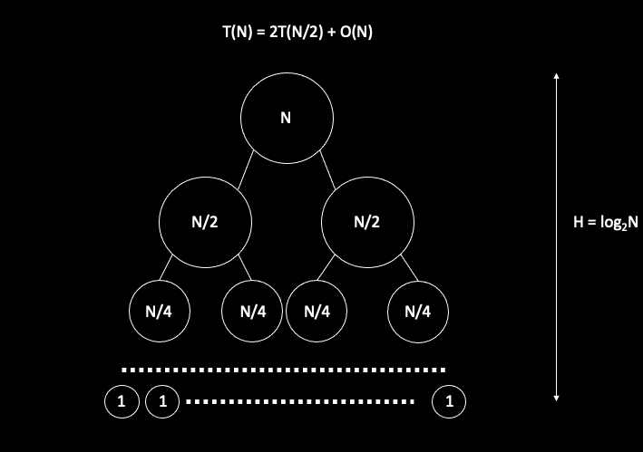

# Angorithm4 Webinar #3

#### Cohost by Jiawei Wang 2021-10-29

## 1. Review ISC


## Trade off
* In 1981s. Compiler technology didn't develop well at that time.
* **Simple Compiler, Complex Hardware vs. Complex Compiler, Simple Hardware**


### Decode in x86:
* **Intel’s and AMD’s x86 implementations translate x86 instructions into programmer-invisible microoperations (simple instructions) in hardware**
* In fact, in most x86-64 machines today, what’s the processors do is that they take the complex instructions, **they translate down**, and save the translated form, so next time, when you get the same instruction, you don’t need to translate it again. You just take the simple micro-operations.
* **All high-performance processors' underneath looks like RISC processors**


## 2. Comparision Sort(I) - Merge Sort

### i. Description
```cpp

void Merge(int* A, int* L, int leftCount, int* R, int rightCount) {
    int i, j, k;
    i = 0, j = 0, k = 0;

    while (i < leftCount && j < rightCount)
    {
        if(R[j] < L[i]) A[k++] = R[j++];
        else A[k++] = L[i++];
    }

    // last check
    while (i < leftCount) A[k++] = L[i++];
    while (j < rightCount) A[k++] = R[j++];

}

void MergeSort(int* A, int n) {
    int mid, *L, *R;

    if (n < 2) return;

    mid = n / 2;

    L = new int[mid];
    R = new int[n - mid];

    for(int i = 0; i < mid; i++) L[i] = A[i];
    for(int j = mid; j < n; j++) R[j-mid] = A[j];

    MergeSort(L, mid);
    MergeSort(R, n-mid);

    Merge(A, L, mid, R, n-mid);

    delete [] R;
    delete [] L;

}

```

```
      5     2     6     1

   |  1     2     5     6  |     
   |  2     5  |  1     6  |
   |  5  |  2  |  6  |  1  |

```

### ii. Analysis
**`T(N) = 2T(N/2) + O(N)`**



### **`O(NlogN)`** 

### iii. Example (LeetCode 315)

**[LeetCode 315 Count Number of Smaller Numbers After Self](https://leetcode.com/problems/count-of-smaller-numbers-after-self/)**

```txt
Input:  [5,2,6,1]
Output: [2,1,1,0]
```

```cpp
class Solution {
public:
    vector<int> countSmaller(vector<int>& nums) {
        for (int i = 0; i < nums.size(); i++) {
            int count = 0;
            for (int j = i+1; j < nums.size(); j++) {
                if (nums[j] < nums[i]) count++;
            }
            nums[i] = count;
        }
        return nums;
    }
};

```
#### Divide and Conquer
```
[A A A A A  B B B B B]
[A A A A A][B B B B B]
```


```
[X X X X]
```

 
```cpp
using namespace::std;

class Solution {
    vector<int> counts;
public:
    vector<int> countSmaller(vector<int>& nums) {
        int N = nums.size();
        counts.resize(N);

        if (N == 0) return {};

        vector<int> sortedNums = nums;

        helper(nums, sortedNums, 0, N-1);

        return counts;
    }

private: 
    void helper(vector<int>& nums, vector<int>& sortedNums, int start, int end) {
        if (start == end) return;


        int mid = start + (end - start) / 2; // round down ((int) x / 2 <= (float) x / 2)
        helper(nums, sortedNums, start, mid);
        helper(nums, sortedNums, mid+1, end);

        for (int i = start; i <= mid; i++) {
            auto iter = lower_bound(sortedNums.begin() + mid + 1, sortedNums.begin() + end + 1, nums[i]); // [mid+1, end+1)
            counts[i] += iter - (sortedNums.begin() + mid + 1); // Ranking in [mid+1, end]
        }
        
        vector<int> temp(end - start + 1); // to store the merged vector from start to end
        // sort(sortedNums.begin()+start, sortedNums.begin()+end+1);

        int i = start, j = mid+1, p = 0;
        while (i <= mid && j <= end) {
            if (sortedNums[i] <= sortedNums[j]) {
                temp[p] = sortedNums[i];
                i++;
            } else {
                temp[p] = sortedNums[j];
                j++;
            }
            p++;
        }

        while (i <= mid) {
            temp[p] = sortedNums[i];
            i++;
            p++;
        }

        while (j <= end) {
            temp[p] = sortedNums[j];
            j++;
            p++;
        }

        for (int i = 0; i < end-start+1; i++) {
            sortedNums[start+i] = temp[i];
        }

    }
};
```

### Runtime

```
      5     2     6     1

   |  1     2     5     6  |  <- counts = [2, 1, 1, 0]
   |  2     5  |  1     6  |  <- counts = [1, 0, 1, 0]
   |  5  |  2  |  6  |  1  |  <- start == end return

```
