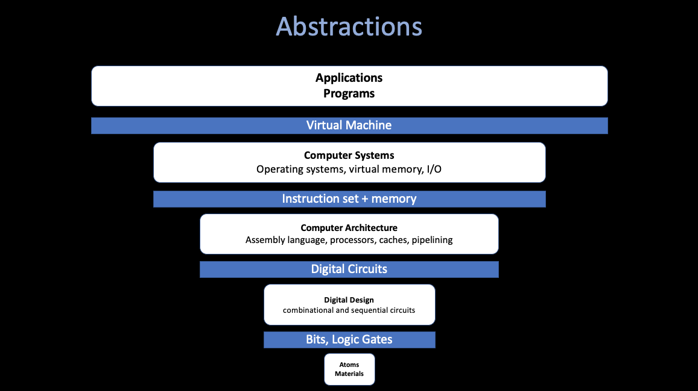
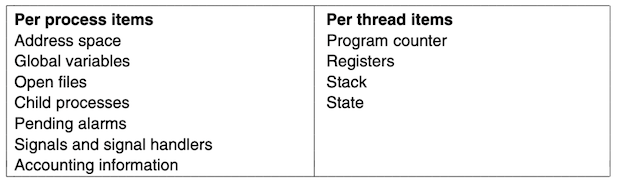
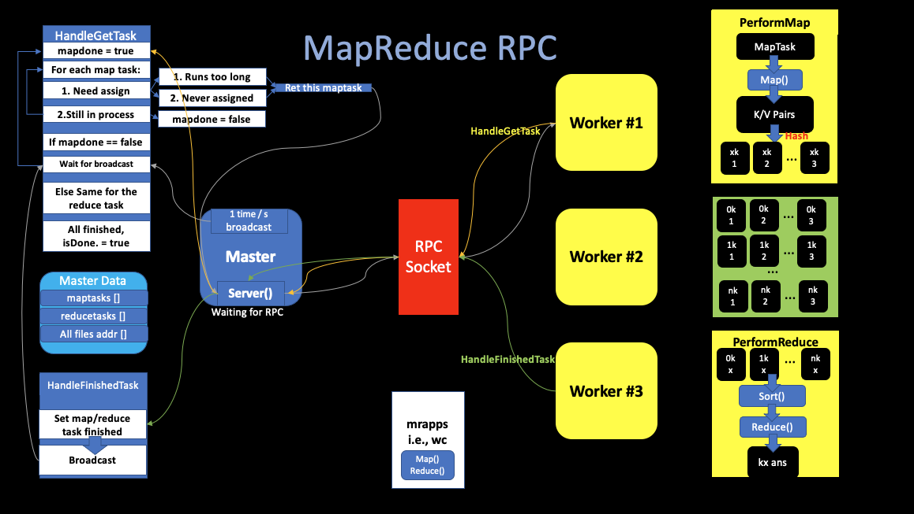

## A4 Spring 2022 Webinar Series

# 1. MapReduce
##### Host By Angold Wang 02/25/2022

### Prologue: The Power of Abstraction

**These Abstractions let us reason about the behavior of our building blocks, without understanding the implementation details underneath.**

## Thread

* **IO concurrency**
    * While some threads are waiting for I/O, other threads can utilize the CPU resources.
* **Parallelism**
    * Execute code in parallel on several cores.
* **Convinence**
    * Relatively simple to programming

### User

* **Most User:** Do not aware / care.
* **Computer Enthusiast (Geek):** Intel Core i7-12700K, 12 Cores / 20 Threads.
* **Some Programmers:** Thread vs. Process.

### Programming Language

* **User-level Threads `(N:M)`**\*
    * The kernel is **not aware** of the existence of these threads.
    * These threads are usually inside 1 or more process, managed by the **Thread Scheduler** of the programming language itself.
    * Example: **Golang: `goroutine`.**
* **Kernel-level Threads `(1:1)`**
    * Kernel Scheduling Entity (KSE)
    * The **minimum-executable** unit in the machine.
    * Managed by the **OS Scheduler**
    * Example: **C: `pthread`, Java: `java.lang.Thread`, C++ `std::thread`**.
 
> **Thread implementation in Golang - Goroutine**

* Each **goroutine** is an independent unit of execution, which have its **unique stack**.
* Go's runtime uses resizable, bounded stacks, initially of only 2KB/goroutine. (the runtime grows and shrinks).
* **Work-stealing** scheduling algorithm.

### Operating Systems
#### Threads and Processes are the same !
#### They are all KSEs, and the OS manage them through the OS Scheduler.

## 1. Distributed Systems

### i. What a Distributed System is?
A set of cooperating computers that are communicating with each other over network to get some conherent task done.

* **Storiage for big websites**
* **Big data computations (MapReduce)**
* **...**

### ii. Why People Need a Distributed System?

Usually, the high-level goal of building a distributed system is to get **scalable speed-up**.

1. **"More" Data and Computations**
2. **Scalability**
    * **2x computers -> 2x throughput (huge win)**
    * **Parallelism:** Split the computations into multiple machines. (MapReduce)
    * **High-throughput:** Split the request data into pieces and read them conrurrently from different servers (GFS).
3. Phsical Reason
4. Security / Isolated

### iii. Challenges
1. **Fault Tolerate.**
    * Big distributed systems: **Failure problems just happen all the time !**
    * The failure has to be built into the design.
    * **Recoverability**
2. **Achieve this Scalability.** (not infinite)
3. **Build the Interface.**
    * The **"Abstraction"**.
    * We'd love to be able to build interfaces that look and act just like non-distributed storage and computation systems, but are actually with vast and extremely high performance fault tolerant distributed systems underneath.

4. **Consistency**
    * How to make **Replicas** consistent.
    * Communication problem (Weak and Strong consistency)

## 2. MapReduce

## 3. Back to Practice

