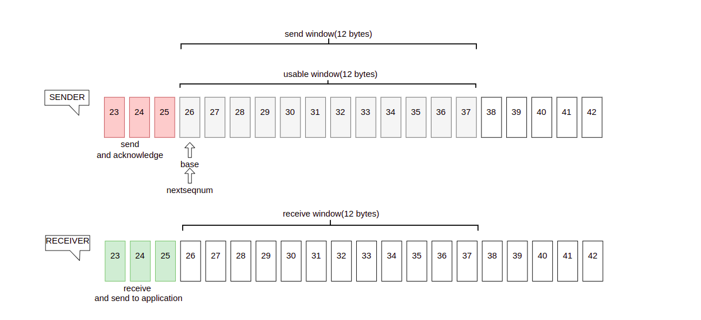
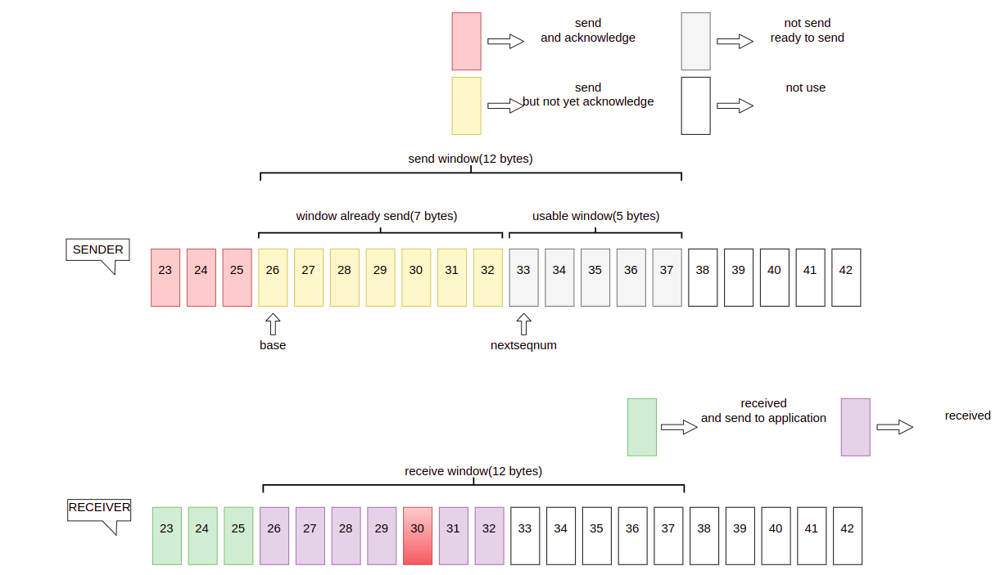
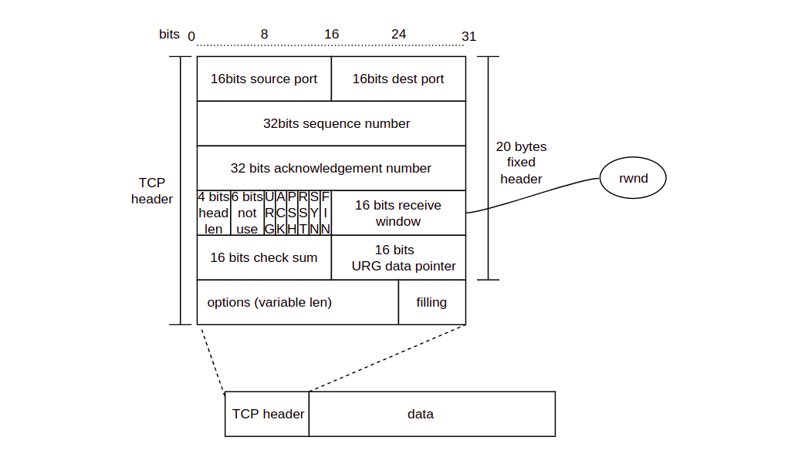
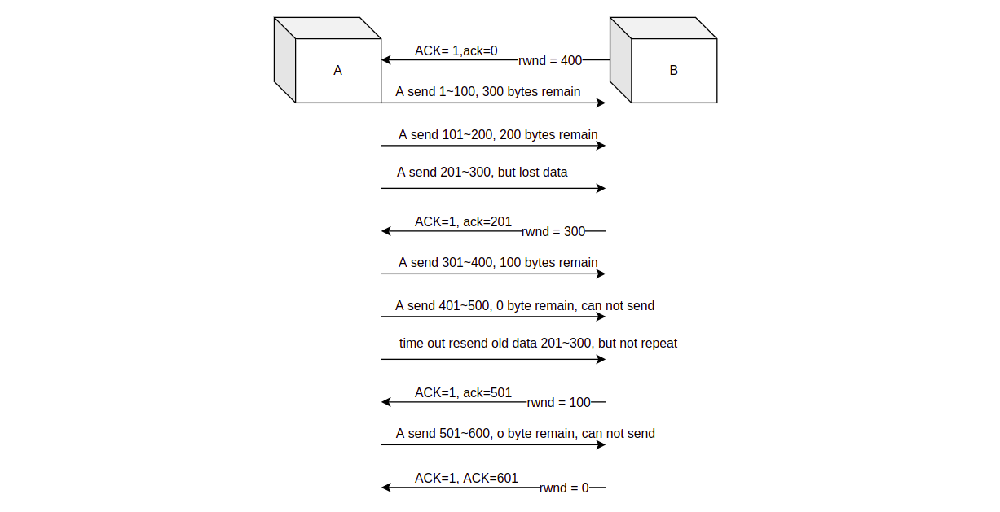

## A4 Spring 2022 Webinar Series

# 4. TCP Flow Control
##### Host By Shuo Feng 03/20/2022

### FLOW CONTROL

#### DEFINITION
We are always looking for faster speed in data transmission, however, a too fast speed is not necessarily a better choise. Usually, if sending speed much faster than receiving speed, it would contribute to the overflow of receive buffer. 
Flow control provide a mechanism which is able to control the rate of data transmission between two nodes to prevent sender faster too much than receiver.

### APPROACH
Now A send data to B, when the connection is establish, the receiver B provide sender A a receive window (rwnd) to show A how much free space in B`s receive buffer. 

Due to full duplex working mode, both A & B maintain a rwnd, we use 'RCVbuffer' to represent the receive buffer of receiver B, 'LastByteRead' represent the last byte that application read from receive buffer, 'LastByteRcvd' represent the last byte arrived in receive buffer.

To avoid buffer overflow, there must have: 

**`LastByteRcvd - LastByteRead <= RcvBuffer`**

And we can get:

**`rwnd = RcvBuffer - [LastByteRcvd - LastByteRead]`**

So what A need to do is control **`[LastByteRcvd - LastByteRead]`** smaller than RcvBuffer

Both sender and receiver have their buffer space ,for receive buffer, when providing data for application process, it also receive data from sender, to avoid buffer overflow, we must control space accroding to free buffer space to ensure that buffer data will not exceed receive buffer.

#### SLIDING WINDOW PROTOCOL

Sliding window is measure for flow control. Siliding window alow sender transmit multiple data group without acknowledgment. 

For sender's window, all data in window can be sended continuously, the larger the window, the faster the transfer speed

For receiver's window, reveiver will send acknowledgment for the last data received in order, when receive data out of data, receiver will storage them in buffer temporarily.

Now A transfers data to B and there is a 12 bytes size window, at the beginning A sends 7 bytes to B

TCP may not resend ACK for each massege, to send 26 ~ 32 in send window, TCP devided then into four parts, seg1: 26 —— 27, seg2: 28 —— 29, seg3: 30, seg4: 31 —— 32.

26 —— 32 was sended sequentially, but B only receive 26, 27, 28, 29, 31, 32, due to 30 was lost in transmission and receiver only send acknowledgment for the highest number that received in order, B send acknowledgment (ack = 30)  to illustrate that 26——29 is received, and for A 26——29 changes from not yet acknowledge to already acknowledge. 31——32 are received but not in order, receiver will storage them in buffer.

Eventhough some data lost in transmission, sender A would not care about ACK and send remianing data in window, when A sends 12 bytes, there is not usable space window and A will stop transmission, to solve this problem, timeout retransmission will kick in.

TCP provides that if sender do not receive acknowledgment in specified time, then it have to transfers the data that have transferred.

##### RETRANSMISSION-TIME OUT

* RTT  : round tirp time
* RTTs : round trip time smoothed
* RTTD : deviation RTT
* RTO  ：retransmission time out
* RFC 6298 recommend: a(Alpha) = 1/8 b(Beta) = 1/4.

#### SLIDING WINDOW in FOLW CONTROL

In TCP header there is a 2 bytes data called receive window (rwnd), to show how much free space in receiver `s receive buffer， which is also tell sender the amount of data that can be send.

Benifit from full duplex working mode, sender can receives data and receiver can also sends data, so before data transmission, receiver B tell A about the free buffer space of B thought receive window in TCP header, and the send window of A can not be bigger than receive window.

