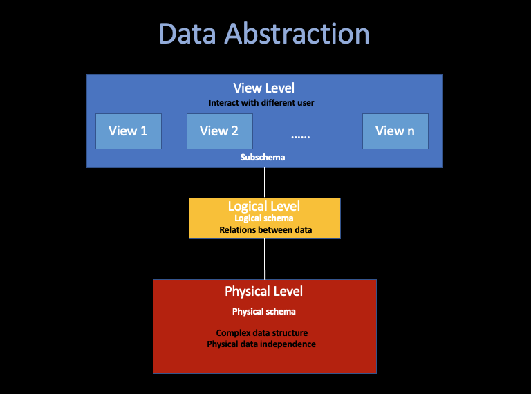

# DBMS

##### 01 Jiawei Wang (Angold-4)

## 0. Abstraction

### Key to Manage Complexity =: Abstraction
Abstraction allows people to use complex equipment or systems without having to understand how the equipment or system is constructed.

## 1. Overview of DBMS

### A Collection of interrelated data (database)
#### Plus
### A Set of programs for accessing these data

#### Usage:
* online transaction processing 
    * small data and update
    * most case
* data analytics
    * make a decision

### DBMS vs. FPS
FPS (File-Processing System), supported by traditional file system which provided by the OS.

#### Data redundancy and inconsistency
* ##### Data redundancy =: same information store in multiple locations in fs.
* ##### Data inconsistency =: different copies of the same data are inconsistent. 

#### Difficulty in accessing data
* ##### There is no convenient and efficient way to obtain data, only according to the needs.

#### Data isolation and integrity problem
* ##### Data isolation =: Data is scattered in different files, which may have different format and accessing method.
* ##### Integrity problem =: Hard to set multiple constrains for specific data 

#### Atomicity problem
* ##### Insure the consistency of the database, some operations must be atomic.
* ##### Either all occur, or do not occur (e.g. Transfer and Accept deposit).

#### Concurrent-access anomaly
* ##### Multiple operations sametime (Add mutex).

#### Security problem
* ##### Permissions, not everyone can check the data in database.

### Instance
The collection of data stored in the database at a specific time is called an instance of the database.;which

### Schema
The design of database =: physical schema, logical schema, subschema.

## 2. DBMS Language

### Data-Definition Language

A series of specific DDL statements are used to illustrate the storage structure and access methods used by the database system. 
which define the implementation detail of DBMS Schema, and there details are invisible to the user.

#### Constraint
* domain constraint 
    * Each attribute must correspond to a domain which composed of all possible values.
* referential intergity
* authorization

The output of executing DDL is called `metadata`, which stores in the data dictionary. 
Data dictionary is a special datastructure, which stores how data is stored in the database. Before reading and modifying the actual data,
the DBMS must first refer to data dictionary.

### Data-Manipulation Language

#### DB accessing type:
* ##### Query the information which stored in the database (query language)
* ##### Insertion, Deletion, Modification

#### Two types of DML
* ##### Procedural DML (i.e. SQL DML)
    * Ask the user to specify what data is needed and how to obtain it.
* ##### Declarative DML
    * Only ask the user to specify the data needed.
    
#### Structured Query Language's DML
The DML of SQL is a non-procedural (declarative) DML, which is easier to learn, but require DBMS to find an efficient way to access data. A query takes one or several tables as input
and always returns only one table.

Non-procedural query language like SQL are not as powerful as a Turing machine, so many operations that can be expressed in general programming language such as C++ cannot be expressed in SQL. 
To interact with user, like recieving input from user or output to display, or other network stuff... Such calculations and actions must be written in a host language, such as C++, Java or Python, in which embedded SQL queries are used to access data in the database

In order to access the database, you need to send DML statements from the host to the DBMS where executes these statements. The most common method is to use an application programm interface. (ODBC JDBC)

## 3. Design of DBMS

### Data Abstraction

A usable system must be able to retrieve data efficiently. This demand for efficiency has prompted DBMS developers to use complex data structures to represent data in database.

System developers use the following levels of data abstraction to shield users from complexity to simplify the interaction between users and the system:

